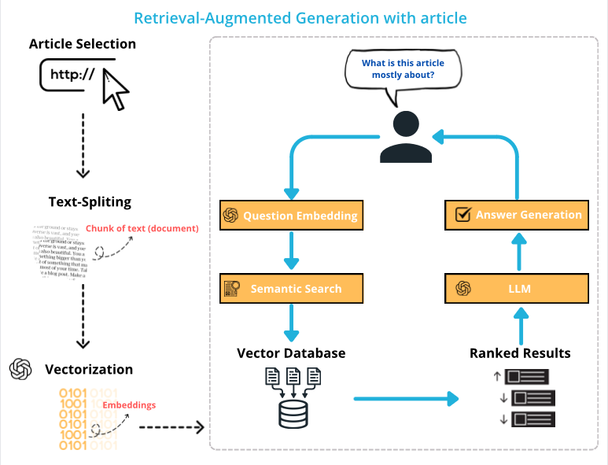

# Marketing AI Advisor 🎯

This Streamlit-based web application leverages advanced NLP and AI to provide insightful analysis and responses based on marketing-related articles. Using the power of LangChain and OpenAI's technologies, it creates an interactive AI assistant that can dissect and discuss the contents of any marketing article you provide.

## Features

- **Article Analysis**: Input the URL of a marketing article, and the app will analyze its content to understand the context and key points.
- **Interactive AI Conversation**: Engage in a dynamic conversation with the AI about the article's content, asking any questions to deepen your understanding or gain additional insights.
- **Contextual Understanding**: The AI retains context from the article and your questions, allowing for a coherent and contextually aware dialogue.
- **Vector Store Creation**: The app breaks down the article into manageable chunks and creates a vector store using `Chroma` for efficient retrieval and analysis.
- **Retrieval Chains**: Utilizes LangChain's retrieval chains to fetch relevant information and generate responses based on the article's context and user queries.

## How It Works

1. **Article Selection**:
   - The process begins with scraping article data from a website using WebBaseLoader, a tool from Langchain that extracts data from HTML and XML files. It parses the raw HTML content into a more manageable form.

2. **Text-Splitting**:
   - After scraping, the text data is divided into smaller chunks or documents using the Recursive Character Text Splitter. This segmentation is a critical step in Natural Language Processing (NLP) for managing data more efficiently.

3. **Vectorization**:
   - Each text chunk is transformed into numerical format known as embeddings. These vectors represent the semantic meaning of the text, facilitating further processing.

4. **Vector Database**:
   - The embeddings are stored in a vector database optimized for high-speed vector searches, crucial for the semantic search phase.

5. **Question Embedding**:
   - Questions like "What is this article mostly about?" are converted into vectors using a similar process to text data vectorization. This allows for comparisons with other vectors in the database.

6. **Semantic Search**:
   - The embedded question is used to perform a semantic search in the vector database. This search identifies the text chunks that are most similar to the question vector.

7. **Retrieval of Information**:
   - **Ranked Results**: Results from the semantic search are ranked based on their relevance to the query, aiding in identifying the most informative text chunks.

8. **Answer Generation**:
   - A Large Language Model uses the ranked results to generate a coherent and contextually appropriate answer.

9. **Conclusion**:
   - The final output is the answer to the query about the website, formulated based on the most relevant text chunks retrieved and processed by the language model.



## Installation
To run this application locally, clone the repository and install the required dependencies:
- ```get your openAI key: https://help.openai.com/en/articles/4936850-where-do-i-find-my-openai-api-key```
- ```git clone Osamalfaifi/Marketing-AI-Advisor```
- ```cd your-repository-directory```
- ```pip install -r requirements.txt```
- ```streamlit run app.py```